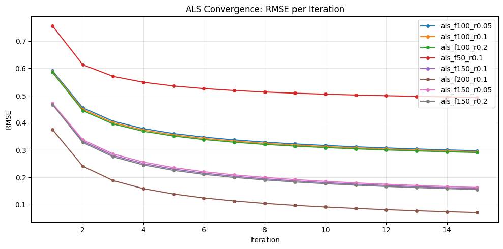

# ALS (Alternating Least Squares) Results

We evaluate the models as recommenders (top-K ranking), using NDCG@10, Precision@10, Recall@10 with a relevance threshold of Rating ≥ 4.0. NDCG@10 uses the original 1–5 ratings as graded relevance, whereas Precision@10 and Recall@10 treat relevance as binary.

## Experimental Setup

- Training length: **15 iterations**
- Relevance: **Rating ≥ 4.0**
- Hyperparameters:
  - `n_factors` ∈ {50, 100, 150, 200}
  - `regularization` ∈ {0.05, 0.1, 0.2}

## Convergence

The plot below shows **training RMSE per ALS iteration**.

RMSE decreases quickly in the first few iterations and then gradually improves, which indicates stable optimization.  
However, lower RMSE does not guarantee the best ranking metrics, since we evaluate top-K recommendation quality on future interactions rather than reconstruction error.

## Results (K = 10)

| model | NDCG@10 | Precision@10 | Recall@10 |
|---|---:|---:|---:|
| als_f50_r0.1 | 0.008936 | 0.006229 | 0.000986 |
| als_f100_r0.05 | 0.009795 | 0.008586 | 0.001137 |
| als_f100_r0.1 | 0.012628 | 0.010859 | 0.001573 |
| als_f100_r0.2 | 0.021663 | 0.019285 | 0.003182 |
| als_f150_r0.05 | 0.018184 | 0.015591 | 0.002984 |
| als_f150_r0.1 | 0.024157 | 0.020660 | 0.004318 |
| als_f150_r0.2 | 0.030870 | 0.026980 | **0.005648** |
| **als_f200_r0.1** | **0.034804** | **0.030165** | 0.005366 |

## Discussion

### 1) More factors significantly improve ranking quality
Performance improves consistently as we increase `n_factors`.  
The best NDCG@10 and Precision@10 come from the largest tested capacity (`n_factors=200`), suggesting that MovieLens benefits from a richer latent representation.

### 2) Regularization is important and interacts with model capacity
At 100 factors, increasing regularization from 0.05 → 0.2 yields a major jump in ranking metrics.  
At 150 factors, regularization=0.2 achieves the best Recall@10 among our runs.

This pattern is consistent with the idea that:
- weaker regularization can overfit to observed ratings
- stronger regularization can improve generalization for top-K ranking

## Possible Next Steps

1) Evaluate the best ALS configs across multiple K values.
2) Extend the regularization sweep around the best region (e.g., 0.15, 0.25, 0.3 for 150–200 factors).
3) Add a lightweight re-ranking stage (re-rank the top-200 candidates produced by ALS using a secondary scoring function) and evaluate whether this improves NDCG@10 without sacrificing recall.
