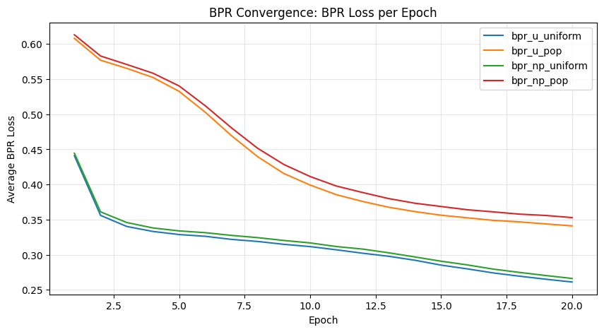

# BPR (Bayesian Personalized Ranking) Results

We evaluate BPR and heuristic baselines as top-K recommenders using ranking metrics with relevance threshold `rating >= 4.0`.
Primary comparison metrics are **NDCG@K**, **Recall@K**, and **MAP@K** (with Precision@K, MRR@K as supporting diagnostics).

## Experimental Setup

- Data split protocol: **global temporal split** (`train / val / test = 75% / 12.5% / 12.5%` by timestamp).
- Model selection protocol: tune on **validation**, report final once on **test**.
- Evaluator: `src.eval.offline_ranking.evaluate` with `ks in {10, 20}`, `mode="all"`.
- BPR optimization:
  - pairwise BPR-OPT objective: `-log(sigmoid(x_ui - x_uj)) + L2`
  - optimizer: SGD (custom training loop)
  - regularization: L2 on user/item factors and item biases
  - negative sampling:
    - strategy: `uniform` or `popularity`
    - pool: `unseen` (default) or `non_positive`
- Heuristics used for comparison:
  - `count` (global popularity)
  - `item_graph` with:
    - `graph_alpha=0.85`
    - `graph_steps=1`
    - `graph_threshold=4.0`
    - `graph_use_rating_weights=False`

## Convergence

The plot below shows the BPR training objective trend across epochs.

All four BPR variants show stable convergence. The average BPR loss decreases monotonically over 20 epochs, indicating consistent improvement in pairwise ranking separation $(x_{ui} - x_{uj})$. The largest loss drop happens in the first ~5–10 epochs, after which the curves flatten, suggesting diminishing returns and that the optimizer is approaching a plateau.

Variants trained with the **unseen** negative pool (`bpr_u_uniform`, `bpr_u_pop`) converge to noticeably lower final loss than the **non_positive** pool (`bpr_np_uniform`, `bpr_np_pop`). This is expected because the non-positive pool introduces harder/more ambiguous negatives (including previously interacted items with low ratings), making the ranking task less separable. Popularity-based sampling mainly shifts the curve slightly but does not change the overall convergence behavior.

## Results (K = 10)

### Main Comparison on Test (BPR vs Heuristics)

| Model | NDCG@10 | Recall@10 | MAP@10 |
|---|---:|---:|---:|
| popularity_count | 0.217267 | 0.042059 | 0.123275 |
| item_graph (alpha=0.85, steps=1) | 0.235137 | 0.048792 | **0.139859** |
| bpr_u_uniform | **0.239079** | **0.050425** | 0.136440 |

### Sampling Sensitivity on Validation

| BPR variant | Negative strategy | Negative pool | NDCG@10 | Recall@10 | MAP@10 |
|---|---|---|---:|---:|---:|
| bpr_u_uniform | uniform | unseen | **0.296268** | **0.055783** | 0.179760 |
| bpr_np_uniform | uniform | non_positive | 0.295926 | 0.055666 | **0.179816** |
| bpr_u_pop | popularity | unseen | 0.282998 | 0.052650 | 0.170202 |
| bpr_np_pop | popularity | non_positive | 0.281619 | 0.053737 | 0.170740 |

## Discussion

### 1) Sensitivity to sampling
- Best validation setup (by NDCG@10) is **`bpr_u_uniform`** (`uniform` negatives, `unseen` pool) with `NDCG@10=0.296268` and `Recall@10=0.055783`.
- The weakest setup on NDCG@10 is `bpr_np_pop` (`0.281619`), so the gain of the best over weakest is about **+0.01465** absolute.
- The key pattern is that **uniform negatives outperform popularity-weighted negatives** in this setting.
- The choice between `unseen` and `non_positive` is much smaller than the strategy effect; both are close under uniform sampling.

### 3) BPR vs heuristics
- On test at K=10, BPR (`bpr_u_uniform`) is best on NDCG and Recall:
  - NDCG@10: **0.239079** (BPR) vs 0.235137 (item_graph) vs 0.217267 (count)
  - Recall@10: **0.050425** (BPR) vs 0.048792 (item_graph) vs 0.042059 (count)
- MAP@10 is highest for item_graph (**0.139859**) vs 0.136440 (BPR), so item_graph has a slight edge in average precision at top-10.
- At K=20, BPR remains strongest on NDCG/Recall (0.230476, 0.075829), while item_graph keeps a small MAP advantage (0.114219 vs 0.111964).
- Practical takeaway: use BPR as the strongest overall learned ranker, and keep item_graph as a robust heuristic baseline/candidate prior.

### 4) Impact on head vs tail items

Head/tail split is defined by training popularity (top 20% items by interaction count = head; remaining 80% = tail).

| Model | Segment | NDCG@10 | Recall@10 | MAP@10 |
|---|---|---:|---:|---:|
| popularity_count | head | 0.228272 | 0.057053 | 0.129284 |
| popularity_count | tail | 0.000000 | 0.000000 | 0.000000 |
| item_graph | head | 0.247517 | 0.065565 | **0.147260** |
| item_graph | tail | 0.000000 | 0.000000 | 0.000000 |
| bpr_u_uniform | head | **0.252704** | **0.069936** | 0.144521 |
| bpr_u_uniform | tail | **0.000521** | **0.000269** | **0.000172** |

For K=20, the same trend holds:
- head segment remains strong (BPR NDCG@20 = 0.249814, Recall@20 = 0.101491),
- tail segment is near-zero for all methods (BPR NDCG@20 = 0.000461; heuristics = 0.000000),

This indicates an extremely hard long-tail regime under this split. Tail items are rare, so in the validation/test splits most users have no tail-relevant interactions at all, or only a single one. As a result, Recall/NDCG on the tail can easily collapse to ~0. Moreover, to retrieve a tail item in Top-10/20 the model needs a very strong personalized signal; in MF/BPR without additional content features, tail items typically underperform due to severe data sparsity.

Head–tail split details: Items total = 3651, head = 730, tail = 2921.

Head-tail split details: Items total=3651, head=730, tail=2921.
