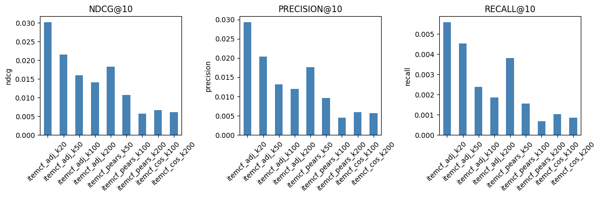

# Item-Item Collaborative Filtering (CF) Results

We evaluate the models as recommenders (top-K ranking), using NDCG@10, Precision@10, Recall@10 with a relevance threshold of Rating ≥ 4.0. NDCG@10 uses the original 1–5 ratings as graded relevance, whereas Precision@10 and Recall@10 treat relevance as binary.

## Experimental Setup

- Metric cutoff: **K = 10**
- Relevance: **Rating ≥ 4.0**
- Compared hyperparameters:
  - Similarity type: cosine / adjusted cosine / pearson
  - Neighborhood size: \(k_{\text{neighbors}} \in \{20, 50, 100, 200\}\)

## Results (K = 10)

| Model | NDCG@10 | Precision@10 | Recall@10 |
|---|---:|---:|---:|
| itemcf_adj_k20 | **0.030249** | **0.029348** | **0.005599** |
| itemcf_adj_k50 | 0.021604 | 0.020369 | 0.004534 |
| itemcf_adj_k100 | 0.015993 | 0.013208 | 0.002379 |
| itemcf_adj_k200 | 0.014127 | 0.012037 | 0.001871 |
| itemcf_pears_k50 | 0.018297 | 0.017625 | 0.003814 |
| itemcf_pears_k100 | 0.010727 | 0.009680 | 0.001561 |
| itemcf_pears_k200 | 0.005734 | 0.004545 | 0.000686 |
| itemcf_cos_k100 | 0.006622 | 0.005902 | 0.001025 |
| itemcf_cos_k200 | 0.006168 | 0.005724 | 0.000861 |

## Visualization

## Discussion

### 1) Adjusted cosine is consistently the strongest similarity
Across all neighborhood sizes, **adjusted cosine** clearly outperforms cosine and pearson.  
This is expected on explicit ratings because users have different rating scales (some consistently rate higher or lower). Adjusted cosine reduces this bias by centering each user’s ratings before computing similarity.

### 2) Smaller neighborhood (k=20) worked best in our setting
Surprisingly, the best overall configuration is **itemcf_adj_k20**, which dominates all other runs on NDCG@10, Precision@10, and Recall@10.

A reasonable interpretation is that for this dataset split and metric definition, using a smaller set of nearest neighbors keeps the signal "cleaner":
- strong neighbors contribute meaningful evidence
- adding more neighbors (k=50, 100, 200) introduces weaker or noisy similarity links, which dilutes ranking quality

### 3) Pearson performs well at k=50 but degrades quickly with larger k
Pearson at k=50 is competitive with adjusted cosine at k=50, but it deteriorates noticeably as k increases.  
This suggests that beyond a small neighborhood, Pearson similarity may amplify noise or unstable correlations from sparse overlaps between items.

### 4) Plain cosine is the weakest baseline here
Cosine similarity without any centering performs worst. This aligns with the idea that raw rating vectors mix preference signal with user-specific scale effects, which harms similarity quality.

## Best Configuration

**Best overall:** `itemcf_adj_k20`  
- NDCG@10: 0.030249  
- Precision@10: 0.029348  
- Recall@10: 0.005599  

This is the configuration we would keep as the CF baseline for comparisons against matrix factorization models (ALS, FunkSVD).

## Possible Next Steps

1) Evaluate the best CF configs across multiple K values to understand the precision–recall trade-off as list length grows.
2) Add RMSE/MAE on held-out rating pairs (optional) if we want a rating-prediction view in addition to ranking metrics.
3) If we later allow minor enhancements, consider:
   - similarity shrinkage (to reduce spurious similarities from few co-ratings)
   - candidate generation + reranking (hybrid CF + content embeddings)
