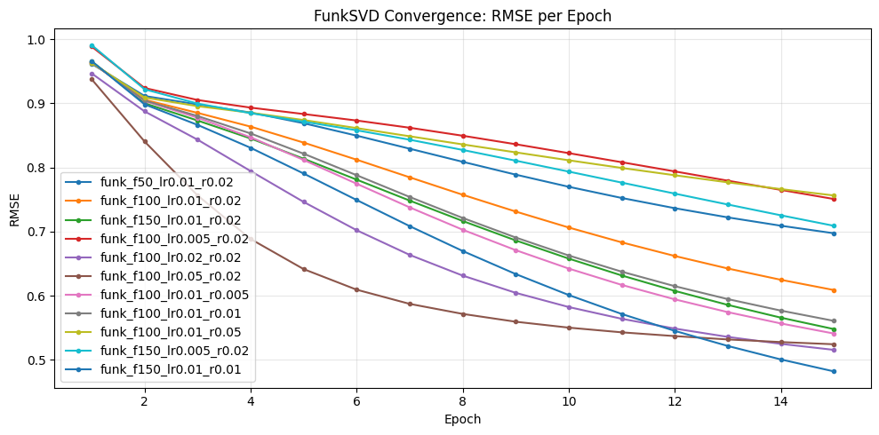

# FunkSVD Results

We evaluate the models as recommenders (top-K ranking), using NDCG@10, Precision@10, Recall@10 with a relevance threshold of Rating ≥ 4.0. NDCG@10 uses the original 1–5 ratings as graded relevance, whereas Precision@10 and Recall@10 treat relevance as binary.

## Experimental Setup

- Training length: **15 epochs**
- Relevance: **Rating ≥ 4.0**
- Compared hyperparameters:
  - `n_factors` ∈ {50, 100, 150}
  - `lr` ∈ {0.005, 0.01, 0.02, 0.05}
  - `regularization` ∈ {0.005, 0.01, 0.02, 0.05}

## Convergence

The plot below shows training RMSE per epoch.

RMSE decreases smoothly across epochs for most configurations.  
Very large learning rates converge faster early on, but tend to produce worse ranking metrics, suggesting poorer generalization.

## Results (K = 10)

| model | NDCG@10 | Precision@10 | Recall@10 |
|---|---:|---:|---:|
| funk_f50_lr0.01_r0.02 | **0.091191** | **0.083375** | **0.020949** |
| funk_f100_lr0.01_r0.02 | 0.082505 | 0.076324 | 0.019277 |
| funk_f150_lr0.01_r0.02 | 0.084076 | 0.074608 | 0.017536 |
| funk_f100_lr0.005_r0.02 | 0.079348 | 0.073428 | 0.018739 |
| funk_f100_lr0.02_r0.02 | 0.068687 | 0.061235 | 0.014503 |
| funk_f100_lr0.05_r0.02 | 0.054382 | 0.051647 | 0.011680 |
| funk_f100_lr0.01_r0.005 | 0.085251 | 0.074747 | 0.017569 |
| funk_f100_lr0.01_r0.01 | 0.083208 | 0.074054 | 0.017622 |
| funk_f100_lr0.01_r0.05 | 0.077837 | 0.073592 | 0.018398 |
| funk_f150_lr0.005_r0.02 | 0.083726 | 0.074164 | 0.018078 |
| funk_f150_lr0.01_r0.01 | 0.082300 | 0.073141 | 0.016974 |

## Discussion

### 1) Best overall configuration in this sweep
The strongest run is `funk_f50_lr0.01_r0.02`. This suggests that, for this dataset split and evaluation protocol, a relatively compact latent dimension (50 factors) is sufficient and may generalize better than larger factor counts.

### 2) Learning rate matters more than factor count
Keeping factors and regularization fixed, increasing `lr` beyond 0.01 hurts performance noticeably:
- `lr=0.02` drops NDCG@10 to ~0.0687
- `lr=0.05` drops NDCG@10 to ~0.0544

Even though high learning rate can reduce RMSE quickly, the ranking metrics degrade, which is a classic sign that optimization is too aggressive or less stable.

### 3) Regularization has a smaller but visible effect
With `lr=0.01` and 100 factors, moderate regularization works best overall.  
Very small regularization can overfit; very large regularization can underfit. In this sweep, values around 0.01–0.02 are generally safe.

### 4) Ranking metrics do not perfectly align with training RMSE
RMSE measures reconstruction error on observed ratings, while NDCG/Precision/Recall measure *how well we rank unseen items* in the future test split.  
As a result, a model with slightly better RMSE is not guaranteed to yield better top-K ranking performance.

## Possible Next Steps

1) Re-evaluate the best few configurations across multiple K values.
2) Add a validation split early-stopping criterion (optional) to avoid overtraining.
3) If we expand the sweep, the next parameters to explore would be:
   - factors in {30, 75} near the best point
   - learning rate in {0.0075, 0.0125}
   - regularization in {0.015, 0.025}

