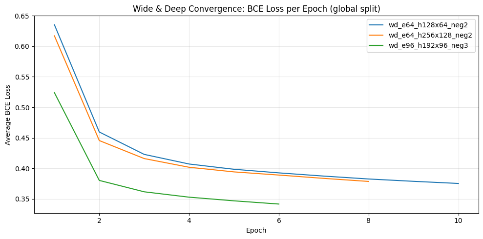
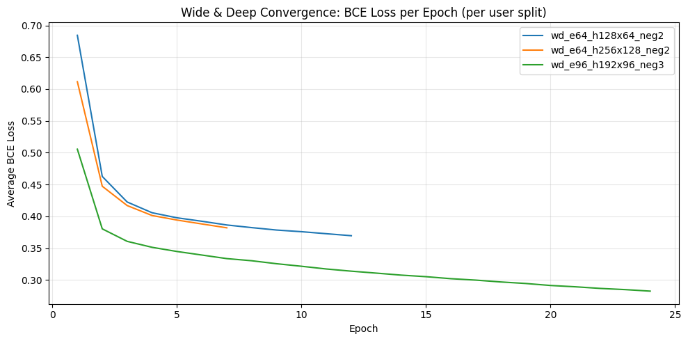

# Wide & Deep Results

We evaluate Wide & Deep as a top-K recommender using ranking metrics with relevance threshold `rating >= 4.0`.
Primary comparison metrics are **NDCG@K**, **Recall@K**, and **MAP@K** (with Precision@K and MRR@K as supporting diagnostics).

## Experimental Setup

- Evaluator: `src.eval.offline_ranking.evaluate`
- Metrics at `k in {10, 20}`
- Evaluation mode: `mode="all"`
- Positive label for training/evaluation: `Rating >= 4.0`
- Model variants:
  - `wd_e64_h128x64_neg2`
  - `wd_e64_h256x128_neg2`
  - `wd_e96_h192x96_neg3`

We report results for two split protocols:
1. **Global temporal split** (`train/val/test = 75/12.5/12.5`)
2. **Per-user temporal split** (`user_based_temporal_train/val = 75/25` per user)

## Convergence

### Global split convergence

### Per-user split convergence

## Global Temporal Split (Validation)

### Hyperparameter ranking

| Model | K | NDCG | Precision | Recall | MRR | MAP |
|---|---:|---:|---:|---:|---:|---:|
| wd_e64_h128x64_neg2 | 10 | **0.290734** | **0.266096** | 0.053618 | 0.448974 | **0.181981** |
| wd_e64_h256x128_neg2 | 10 | 0.288953 | 0.261384 | 0.054461 | **0.453558** | 0.175204 |
| wd_e96_h192x96_neg3 | 10 | 0.286388 | 0.262775 | **0.055095** | 0.441582 | 0.176183 |
| wd_e64_h128x64_neg2 | 20 | **0.277344** | **0.242214** | **0.085664** | 0.455063 | **0.149979** |
| wd_e64_h256x128_neg2 | 20 | 0.274152 | 0.237416 | 0.085375 | **0.457533** | 0.143993 |
| wd_e96_h192x96_neg3 | 20 | 0.271863 | 0.236765 | 0.085332 | 0.446382 | 0.143722 |

Best on global validation by NDCG@10: **`wd_e64_h128x64_neg2`**.

### Evaluation diagnostics

- `n_users_evaluated = 1188`
- `n_skipped = 4852`
- `skip_rate = 0.803311`
- `coverage_rate = 1.0`
- `avg_list_size = 20.0`

### Performance metrics (global split variants)

| Model | Total training time (s) | Total prediction time (s) | Users predicted | Time per user (ms) |
|---|---:|---:|---:|---:|
| wd_e64_h128x64_neg2 | 310.415322 | 19.883847 | 6040 | **3.292028** |
| wd_e64_h256x128_neg2 | 298.975834 | 25.303457 | 6040 | 4.189314 |
| wd_e96_h192x96_neg3 | **241.511821** | 24.603437 | 6040 | 4.073417 |

Best-global model runtime summary:

| Model | Total training time (s) | Total prediction time (s) | Users predicted | Time per user (ms) |
|---|---:|---:|---:|---:|
| wd_e64_h128x64_neg2 | 310.415322 | 19.883847 | 6040 | 3.292028 |

## Per-User Temporal Split (Validation)

Per-user split sizes:
- `user_based_temporal_train = 747,909`
- `user_based_temporal_val = 252,300`

### Hyperparameter ranking

| Model | K | NDCG | Precision | Recall | MRR | MAP |
|---|---:|---:|---:|---:|---:|---:|
| wd_e96_h192x96_neg3 | 10 | **0.127610** | **0.109153** | **0.048512** | **0.238891** | **0.059363** |
| wd_e64_h128x64_neg2 | 10 | 0.121950 | 0.103495 | 0.043868 | 0.226714 | 0.056448 |
| wd_e64_h256x128_neg2 | 10 | 0.120474 | 0.101112 | 0.042312 | 0.223049 | 0.055835 |
| wd_e96_h192x96_neg3 | 20 | **0.129963** | **0.098684** | **0.066167** | **0.248285** | **0.048952** |
| wd_e64_h128x64_neg2 | 20 | 0.123319 | 0.093528 | 0.061059 | 0.235949 | 0.046259 |
| wd_e64_h256x128_neg2 | 20 | 0.121750 | 0.091101 | 0.059054 | 0.232651 | 0.045090 |

Best on per-user validation by NDCG@10: **`wd_e96_h192x96_neg3`**.

### Evaluation diagnostics

- `n_users_evaluated = 5999`
- `n_skipped = 41`
- `skip_rate = 0.006788`
- `coverage_rate = 1.0`
- `avg_list_size = 20.0`

### Performance metrics (best per-user model)

| Model | Split | Total training time (s) | Total prediction time (s) | Users predicted | Time per user (ms) |
|---|---|---:|---:|---:|---:|
| wd_e96_h192x96_neg3 | per_user_temporal | 1171.790662 | 25.601570 | 6040 | 4.238670 |

## Protocol Comparison (Best Variant per Split)

| Protocol | Best model | NDCG@10 | Recall@10 | MAP@10 | Total training time (s) | Total prediction time (s) | Time per user (ms) |
|---|---|---:|---:|---:|---:|---:|---:|
| global_temporal_75_12.5_12.5 | wd_e64_h128x64_neg2 | **0.290734** | 0.053618 | **0.181981** | 310.415322 | 19.883847 | **3.292028** |
| per_user_temporal_75_25 | wd_e96_h192x96_neg3 | 0.127610 | 0.048512 | 0.059363 | 1171.790662 | 25.601570 | 4.238670 |

## Discussion

### 1) Skip rate strongly changes the evaluated population

Global split has very high skip rate (`~80.3%`), while per-user split has very low skip rate (`~0.7%`).
Because users without relevant items are skipped from averaging, these two protocols evaluate very different effective user cohorts.
This alone can create large metric differences even with the same model class.

### 2) Temporal structure changes supervision density per user

Per-user temporal split guarantees each user contributes both train and validation interactions (except corner cases), which improves warm-user coverage and reduces sparsity at evaluation.
Global split is chronologically stricter but leaves many users without enough relevant validation events under thresholded relevance.

### 3) Seen-item masking interacts with split geometry

Seen-item masking is applied against the provided training interactions.
Under per-user split, each user has richer, user-specific seen history, which can alter candidate composition and ranking difficulty differently than a global cut.

### 4) Representation and objective interaction

Wide & Deep uses:
- linear memorization terms (wide path),
- nonlinear feature composition (deep path),
- side features (demographics + genres),
- sampled implicit negatives.

Its ranking quality depends on how much informative user-specific signal survives in train vs validation for each protocol.
When per-user histories are richer and more uniformly available, different hyperparameter settings (here `wd_e96_h192x96_neg3`) can dominate, while global split favored a smaller configuration (`wd_e64_h128x64_neg2`).

### 5) Compute differences

Per-user best run required substantially longer training time than global best run (1171.8s vs 310.4s), reflecting split-dependent training dynamics and selected configuration differences.
