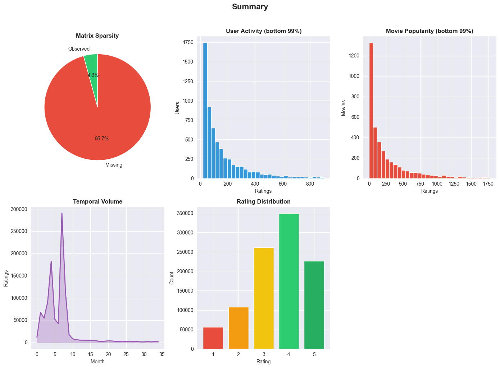
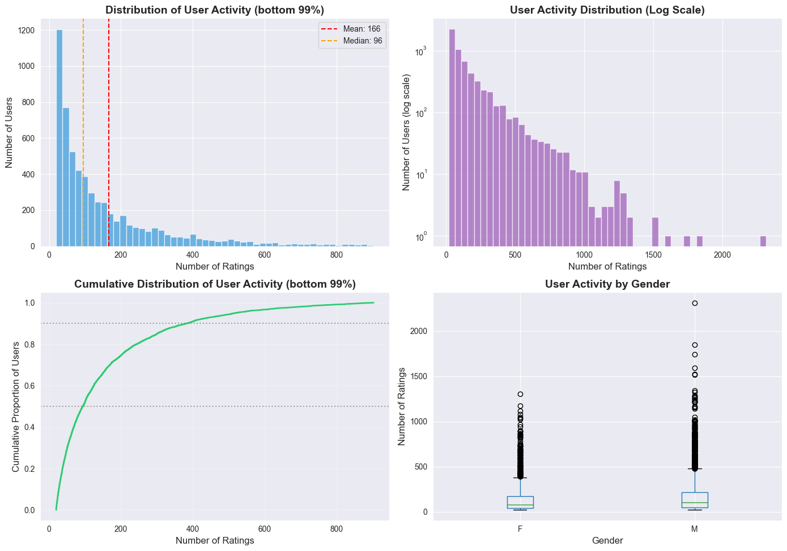
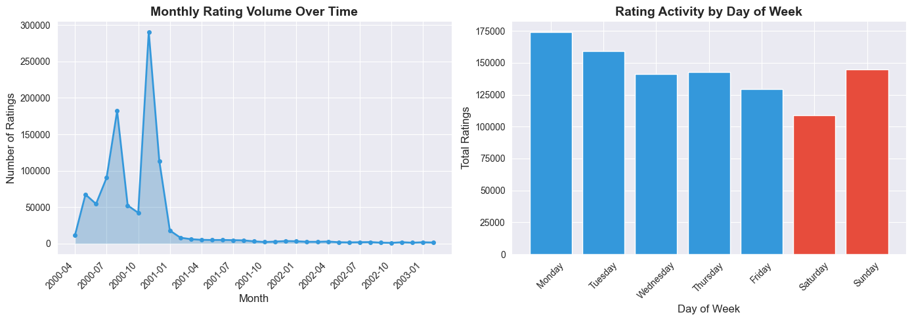
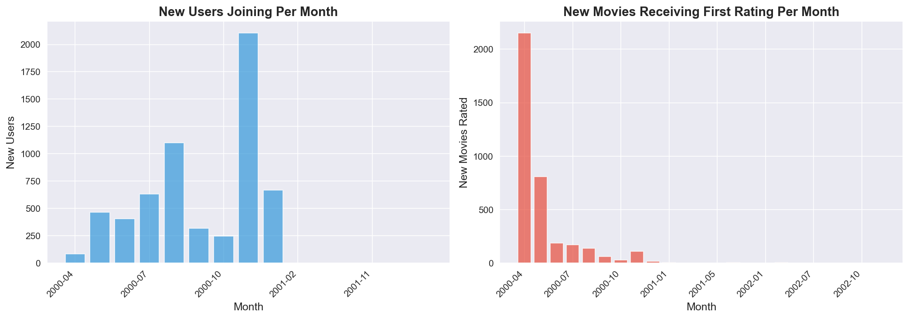
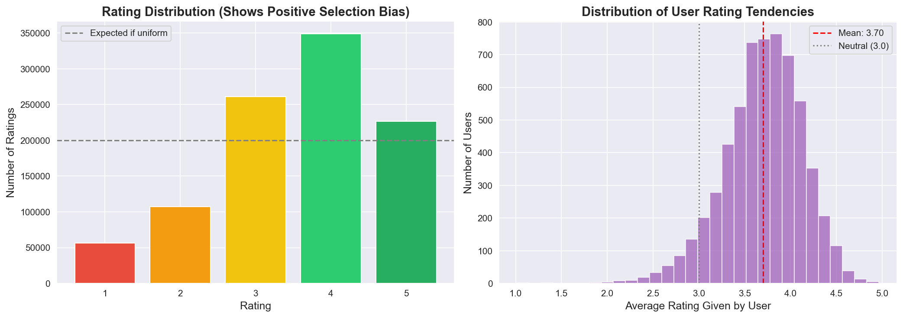

# MovieLens 1M: Exploratory Data Analysis Summary

## 1. Dataset at a Glance

The MovieLens 1M dataset contains **1,000,209** explicit ratings (scale 1-5) from **6,040 users** across **3,883 movies**, collected between April 25, 2000 and February 28, 2003 (1,038 days). Each user has at least 20 ratings, and side-information includes user demographics (gender, age, occupation, zip code) and movie genres.

---

## 2. Interaction Sparsity

The user-item interaction matrix has a **sparsity of 95.74%** (density 4.27%). Out of ~23.5 million possible user-movie pairs, only ~1 million are observed. The scatter plot below visualizes a 100-user x 200-movie sample, making the emptiness of the matrix immediately apparent.

### Modeling implication

With over 95% of entries missing, **memory-based collaborative filtering** (user-kNN or item-kNN) will suffer from unreliable similarity estimates for users/items with little overlap. **Matrix factorization** (e.g., SVD, ALS) is a natural first choice: it projects users and items into a shared low-dimensional latent space, sidestepping the need for full pairwise overlap. Regularization (L2 on latent factors) is essential to prevent overfitting to the sparse observed entries. Although deep autoencoders and neural collaborative filtering could model this sparsity, our focus is on classical MF and neighbor-based approaches, which remain strong baselines on data of this scale.

---

## 3. User Activity Distribution

User activity is heavily right-skewed (mean = 165.6, median = 96.0, std = 192.7). A small power-user cohort dominates the dataset:

| Segment             | % of Users | % of Ratings |
|---------------------|------------|--------------|
| Low (20-50)         | 29.7%      | 6%           |
| Medium (51-100)     | 22.2%      | 9.7%         |
| High (101-200)      | 22.0%      | 18.9%        |
| Very High (201-500) | 19.6%      | 36.6%        |
| Power Users (500+)  | 6.6%       | 28.9%        |

The top 6.6% of users (power users) contribute nearly **29%** of all ratings, while the bottom ~30% of users contribute barely 6%.

### Modeling implication

A model trained with uniform weighting will disproportionately learn the preferences of power users and underperform on the low-activity majority. Strategies to consider:

- **Stratified train/test splits** by user activity tier, ensuring evaluation reflects all segments, not just the well-represented power users.
- **Per-user regularization** in matrix factorization: stronger regularization for users with few interactions prevents their latent vectors from overfitting.
- **Neighbor-based methods** (user-kNN) may work well for power users who share many items with others, but will degrade for low-activity users where overlap is slim. For those users, falling back to **item-kNN** (which leverages the item side, where overlap tends to be richer) or a **content-based** component will be preferred.

---

## 4. Item (Movie) Popularity Distribution

Movie popularity is equally skewed (mean = 269.9, median = 123.5, std = 384.0). The most-rated movie has 3,428 ratings; the least-rated has just 1. The histogram and top-15 chart below illustrate the extreme concentration.

### Modeling implication

The long tail of rarely-rated movies means that purely collaborative methods will have very poor latent representations for those items. A **hybrid approach** should work better: combine collaborative filtering scores with **content-based features** (genre vectors, release year) so that even items with minimal interaction history can receive meaningful predictions. In item-kNN, genre overlap can serve as a fallback similarity when rating-based similarity is unreliable.

---

## 5. Temporal Dynamics

Rating volume fluctuates significantly over the 35-month span, with observable bursts and quieter periods. Day-of-week analysis reveals somewhat higher activity on weekdays. Moreover, the rate of new users joining and new movies first being rated is uneven across time.

### Modeling implication

**Evaluation must respect temporal order.** Random train/test splits would leak future information into training, producing overly optimistic offline metrics that do not reflect real-world deployment.

---

## 6. Data Pathologies

### 6.1 Popularity Skew

The **Gini coefficient of movie rating counts is 0.634**, indicating high inequality. The top 20% of movies account for **65.2%** of all ratings.

**Modeling implication.** Standard accuracy metrics (RMSE, MAE) are dominated by predictions on popular items, masking poor performance on the long tail. Evaluation should include:

- **Coverage**: fraction of the catalog that ever appears in recommendations.
- **Per-popularity-bucket metrics**: report RMSE separately for head vs. tail items.

On the modeling side, matrix factorization with **bias terms** (global, user, and item biases) will partially absorb popularity effects. Without bias correction, a collaborative model will likely degenerate into a popularity-based ranker. Adding item-level popularity as a feature (or a bias term in the loss function) lets the latent factors focus on genuine preference signal rather than mere exposure frequency.

### 6.2 Cold-Start Problem

| Entity         | Cold Threshold | Count | % of Total |
|----------------|---------------|-------|------------|
| Users          | < 30 ratings  | 751   | 12.4%      |
| Users (severe) | < 23 ratings  | 254   | 4.2%       |
| Items          | < 10 ratings  | 446   | 12.0%      |
| Items (severe) | < 5 ratings   | 290   | 7.8%       |

Roughly **1 in 8** users and **1 in 8** movies fall below the cold-start threshold.

**Modeling implication.** Pure collaborative filtering (whether kNN or MF) cannot produce reliable predictions for cold entities.

### 6.3 Rating / Selection Bias

The mean rating is **3.58**, well above the scale midpoint of 3.0. Ratings of 4 dominate the distribution, and ratings of 1-2 are comparatively rare. This is not because all movies are good, but because users preferentially watch (and rate) movies they expect to enjoy. Additionally, users are usually more biased towards higher ratings.

---

## 7. Consolidated Modeling Recommendations

| Finding                  | What we can do about it / what it implcates               |
|--------------------------|-----------------------------------------------------------|
| 95.7% sparsity           | Matrix factorization (SVD / ALS) with L2 regularization   |
| Power-law user activity  | Stratified evaluation; per-user regularization strength   |
| Long-tail item popularity | Add bias terms; evaluate coverage and per-bucket metrics  |
| Temporal non-stationarity | Temporal train/test split                                 |
| 12% cold-start entities  | Similarity filtering will suffer                          |
| Rating bias       | Preprocess data to make ratings more normally-distributed |

> **Note on deep learning.** Neural approaches (autoencoders, NCF, graph neural networks) could potentially improve upon these classical methods, especially on cold-start via learned feature embeddings. However, on a dataset of this scale (~1M interactions), well-tuned matrix factorization and neighbor-based methods are highly competitive, faster to train and easier to interpret. We therefore focus on classical methods as our primary modeling strategy.
